# Data Flow Diagrams
## Standard Notes Enhanced Editor

---

## 1. SYSTEM ARCHITECTURE OVERVIEW

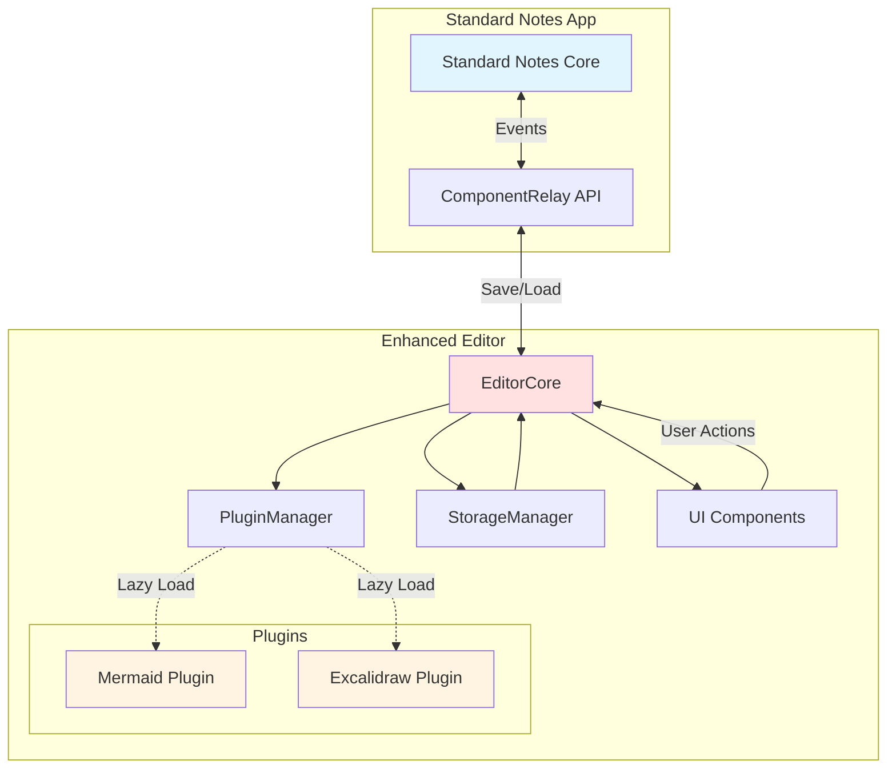

---

## 2. INITIALIZATION FLOW

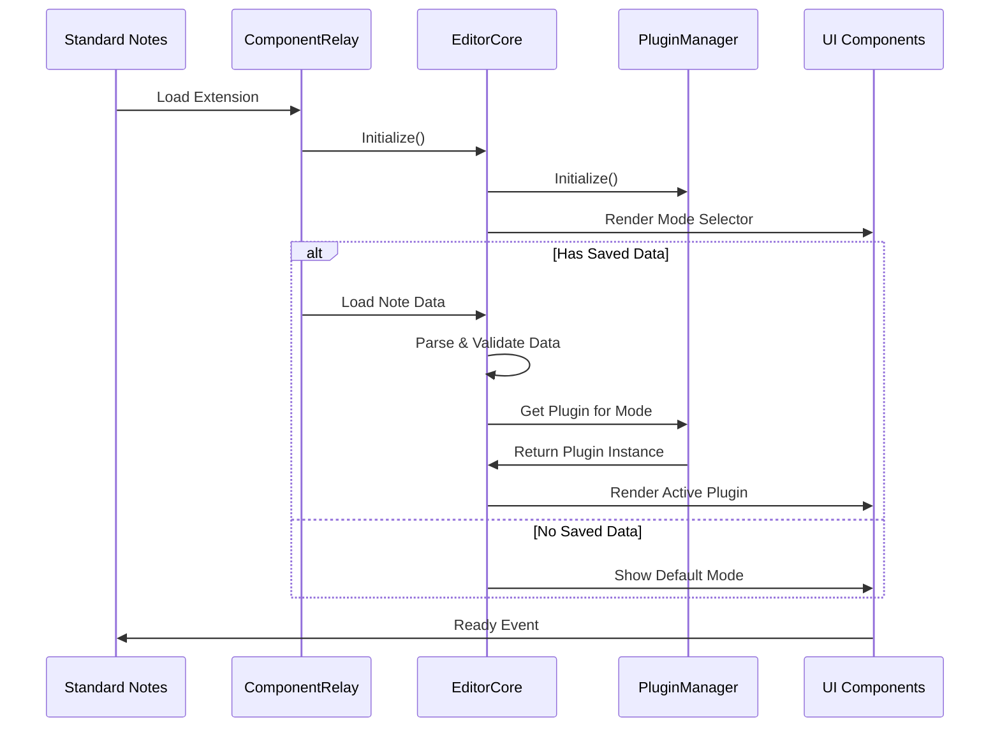

---

## 3. MODE SWITCHING FLOW

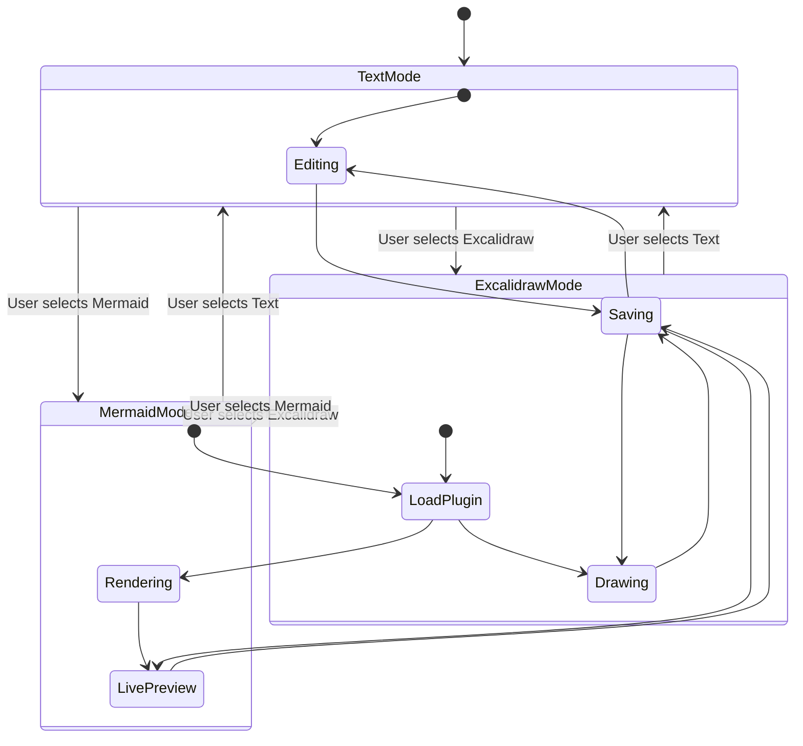

---

## 4. DATA PERSISTENCE FLOW

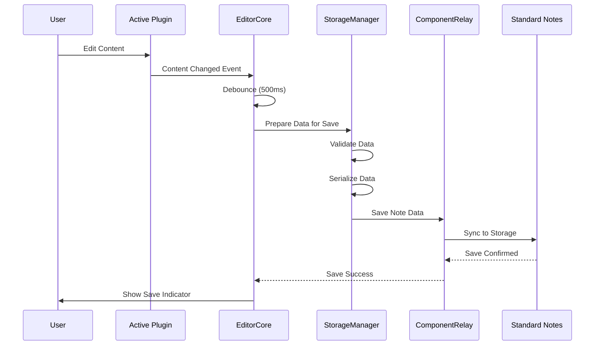

---

## 5. PLUGIN LIFECYCLE

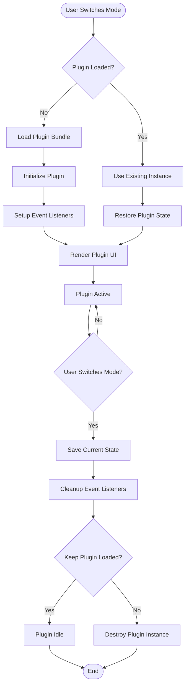

---

## 6. ERROR HANDLING FLOW

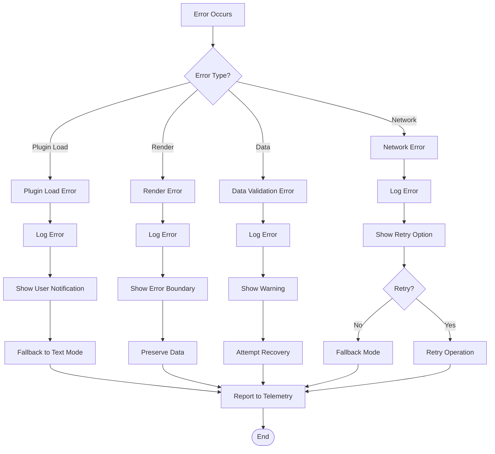

---

## 7. MERMAID PLUGIN DATA FLOW

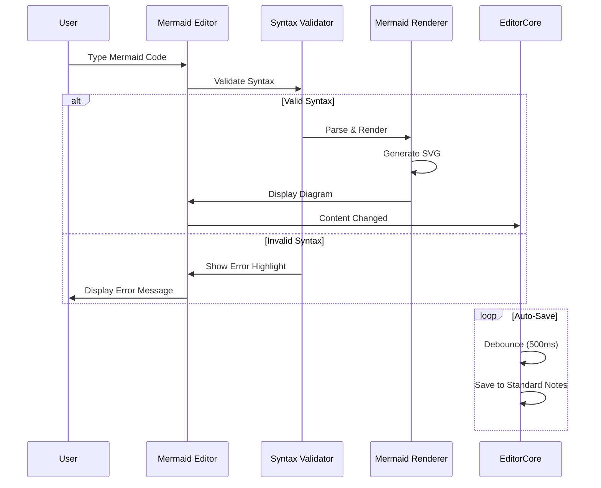

---

## 8. EXCALIDRAW PLUGIN DATA FLOW

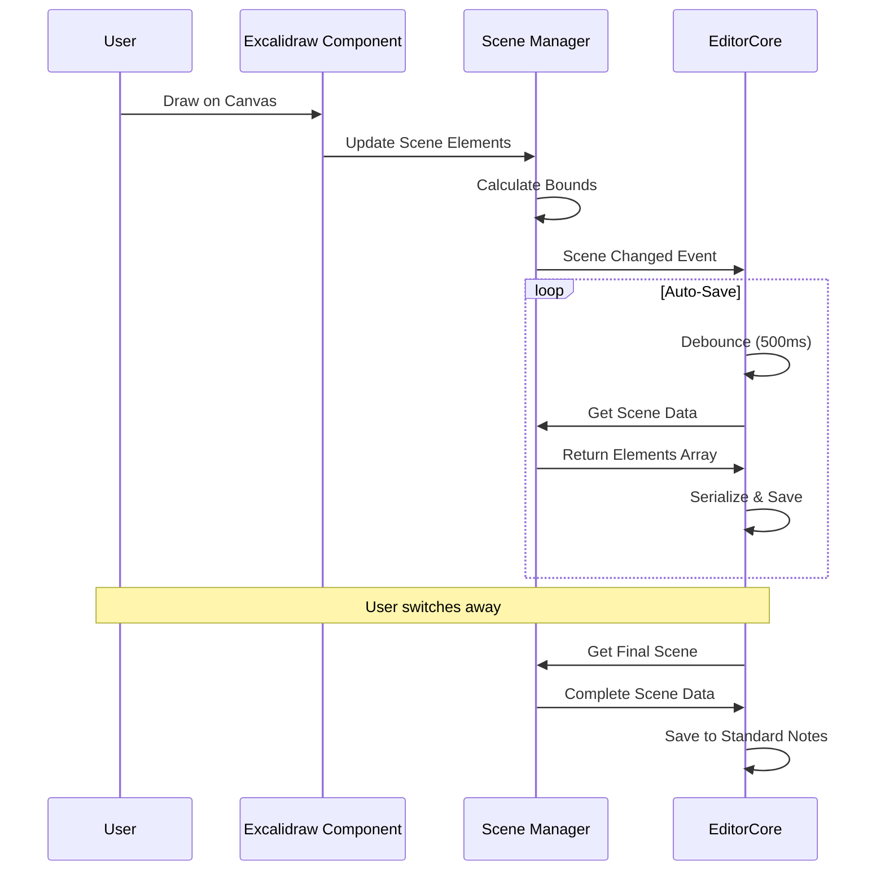

---

## 9. BUILD & DEPLOYMENT FLOW

```mermaid
flowchart LR
    subgraph Development
        Code[Write Code] --> Test[Run Tests]
        Test --> Lint[Lint & Format]
    end

    subgraph Build
        Lint --> Webpack[Webpack Build]
        Webpack --> Split[Code Splitting]
        Split --> Minify[Minify & Optimize]
    end

    subgraph Quality
        Minify --> Unit[Unit Tests]
        Unit --> Integration[Integration Tests]
        Integration --> E2E[E2E Tests]
    end

    subgraph Deploy
        E2E --> Package[Create Package]
        Package --> Git[Push to GitHub]
        Git --> Action[GitHub Action]
        Action --> CF[Deploy to Cloudflare]
        CF --> CDN[CDN Distribution]
    end

    style Development fill:#e1f5ff
    style Build fill:#ffe1e1
    style Quality fill:#fff4e1
    style Deploy fill:#e1ffe1
```

---

## 10. USER JOURNEY - CREATE MERMAID DIAGRAM

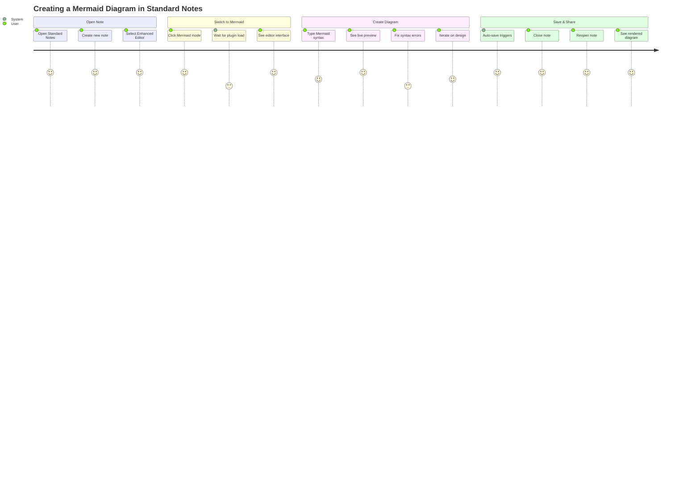

---

## 11. DATA STRUCTURE FLOW

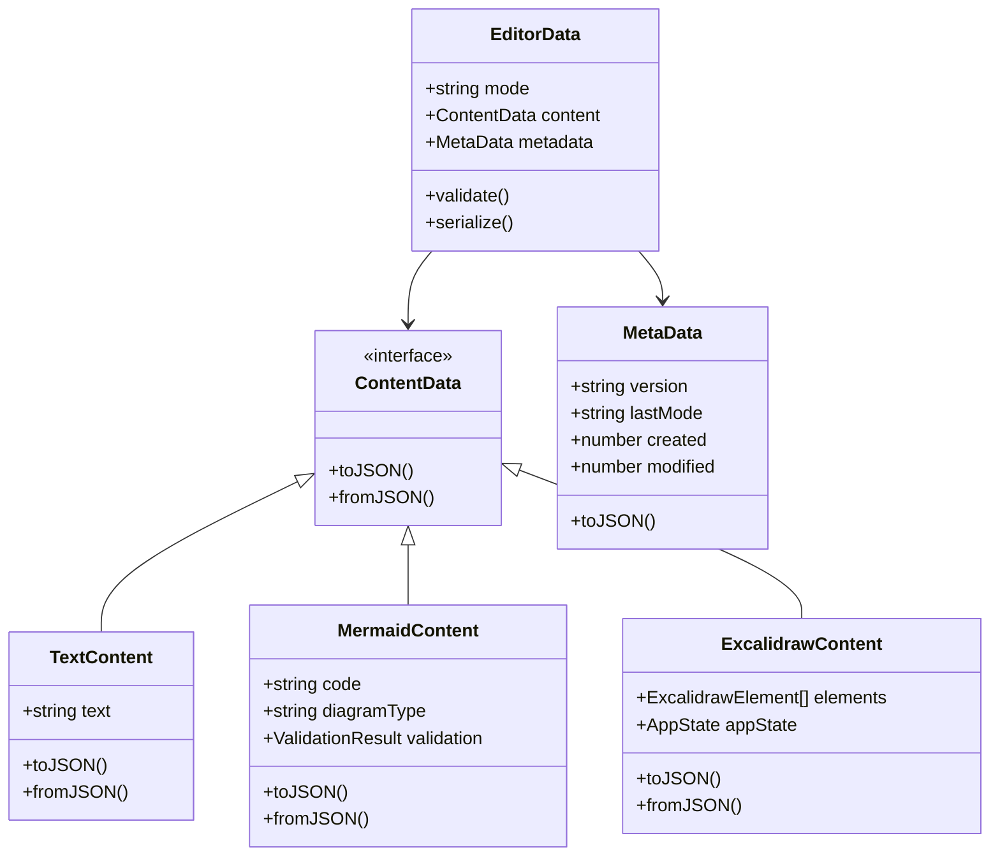

---

## 12. PERFORMANCE OPTIMIZATION FLOW

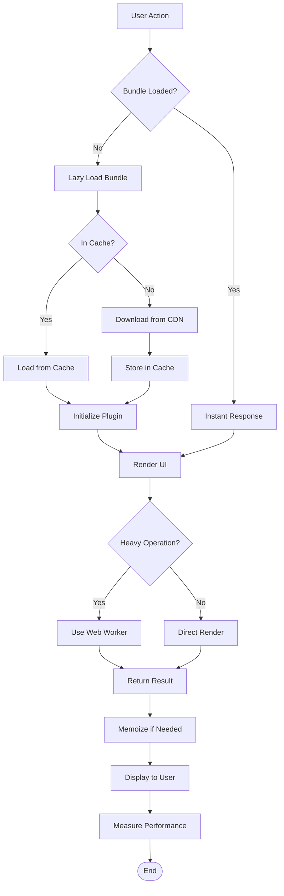

---

**Document Owner:** Mike Schlottig
**Last Updated:** 2025-09-29